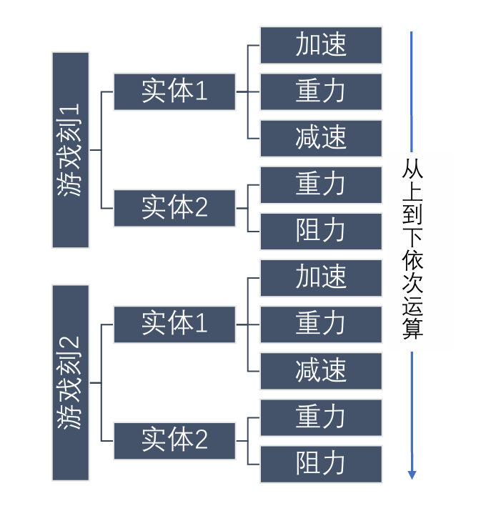
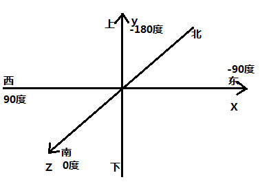
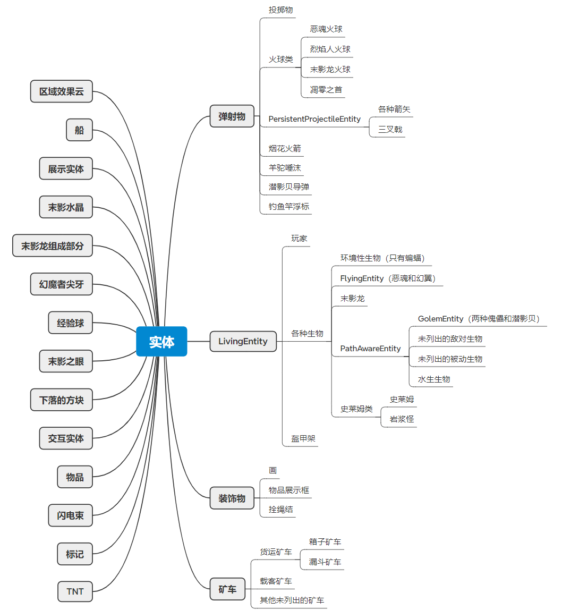
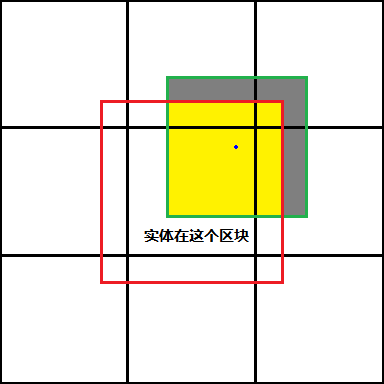

# 01-实体运动的基本概念

像研究经典力学一样，研究实体运动也需要一套恰到好处的概念体系。

## 实体运动的运算方式

Minecraft中，实体的运动主要发生在实体自身的运算过程内，而每个实体的运算在每游戏刻固定执行一次，一个游戏刻恰好对应实体的一个运算周期。微观上，实体运动运算可被分为功能不同的若干代码段，有的负责变速，有的负责移动，我们将在稍后再深入讨论。现在，我们只需要知道实体自由运动运算符合形如下图的模型：

## 基本概念

| 物理量             | 单位         | 符号      | 到标准单位的换算    |
| ------------------ | ------------ | --------- | ------------------- |
| 时间               | [游戏]刻     | $gt$      |                     |
|                    | [无卡顿的]秒 | $s$       | $1s=20gt$           |
| 长度、位移         | 米           | $m$       |                     |
|                    | 格           | $b$       | $1s=1b$             |
| 速度、Motion、冲量 | 米每刻       | $m/gt$    |                     |
|                    | 米每秒       | $m/s$     | $1m/s=0.05m/gt$     |
| 加速度             | 米每平方刻   | $m/gt^2$  |                     |
|                    | 米每平方秒   | $m/s^2$   | $1m/s^2=0.0025m/gt$ |
| 阻力系数           | 负一次方刻   | $gt^{-1}$ |                     |

### 碰撞箱

**碰撞箱**是一个标明实体所范围的长方体区域，是实体运动当中最直观的概念之一。

碰撞箱的朝向不随实体朝向的改变而改变，其各个面总是与坐标平面平行。实体碰撞箱的顶面和底面往往是正方形，侧面则可以是任意的矩形。

利用原版的`F3 + B`快捷键，我们可以看到实体的碰撞箱，但需要注意的是，受客户端渲染插值的影响，运动中的实体及其碰撞箱的显示位置与其在服务端的实际情况并不符合。这里我们可以使用MessMod的`serverSyncedBox`选项来显示更准确的实体碰撞箱。

### 坐标与位移

为简化表述，参照“质点”的思想，我们规定实体的**坐标**为碰撞箱底面的中心点（实体坐标点）在Minecraft坐标系中的位置，并称该点为实体的**坐标点**。这一坐标定义与游戏内的`Pos`标签和源码中字段`pos`相一致。

一个过程中实体坐标的改变量为实体的**位移**。

细节上，本章通常不认为实体发生跨维度传送造成的坐标改变应被当作位移的有效取值，并认为传送造成的坐标改变在此处的位移中应被剔除。这些规则同样适用于速度等由位移衍生出的变量。

在此给出坐标系详情如下图所示。

### 速度与Motion

与牛顿力学类似，速度是实体在单位时间内运动的位移，而**平均速度**可以表示为位移与对应时间长度之比。

但是，考虑到Minecraft中时间存在一个基本单位（游戏刻），瞬时速度“瞬时化”的过程不能无限地进行下去，我们仿照平均速度的定义，至多只能定义出一个游戏刻的**瞬时速度**为某个游戏刻中实体的平均速度，即相应游戏刻内实体的位移与游戏刻时长1 gt的比值。然而，单个游戏刻中实体的速度事实上也可以视为发生了多次变化。比如，我们可以认为，每次爆炸推进、每次粘液块弹射、每个自身运动运算阶段前后，实体的“速度”都会发生改变，而日后的应用会表明，接受这样更细粒度的“瞬时速度”会为表述与分析带来极大的方便。

于是，我们必须定义一种更加“瞬时”的速度。参照源码，我们很自然地选择采用实体的`velocity`字段来定义这种速度，并依照其在MCP映射当中的译名和对应的NBT标签称之为**Motion**。通常而言，Motion是一个三维向量，存储了实体任意时刻应该具有的的速度，在负责“移动”，即产生坐标变化的运算阶段当中，实体的Motion会成为当前游戏刻中实体的位移趋势，继而成为当前游戏刻中实体的速度。

举个例子，假设某个实体的Motion（方向不在考虑之列）为1.0m/gt，并在某个游戏刻中经历了如下运算：

1. 被爆炸推进，Motion增加0.5m/gt，达到1.5m/gt
2. 被爆炸推进，Motion增加0.5m/gt，达到2.0m/gt
3. 实体坐标的数值增加Motion的数值，移动2.0m，Motion不变
4. 阻力作用，Motion减少到0.98倍，变化为1.96m/gt

这样，一个游戏刻当中实体的Motion会在不同的运算阶段前后取得1.0m/gt、1.5m/gt、2.0m/gt和1.96m/gt，但是其中只有2.0m/gt这一个取值被作为了实体的速度。

需要澄清的是，实体的速度不一定完全由Motion决定，Motion也不一定能够取到速度的取值。第一，Minecraft中存在不由Motion决定的改变坐标的机制，比如活塞推动，这会为实体带来Motion所无法决定的位移。第二，实体在运动过程中会受到碰撞，使得Motion决定的位移趋势不能完全成为位移。第三，严格意义上，“移动”类步骤不一定以“实体坐标的数值增加Motion的数值”的形式出现，实际上，存在极少数的实体会将Motion的数值乘以一个通常小于1的倍率（Motion本身的取值不变）后再加到位移当中。为处理这种现象，我们可以选择将这种乘以一定倍率的过程视作一个运算阶段，并将乘以倍率后未被存回的Motion取值视作Motion的一个取值，尽管这样略微地偏离了Motion的严格定义。第四，末影水晶等特殊实体和被弱加载的实体的Motion不能造成其运动，它们的Motion取值通常不会对其行为产生任何影响。

总结来说，实体的速度由实体坐标变化决定，侧重于实际的结果，而Motion作为决定实体位移的量，更侧重于反映实体理应具有的自发移动趋势。“可以这样认为，Motion是实体运动的决定，而速度是实体运动的结果。”

### 冲量与加速度

实体运算中，存在很多小于1gt的不可细分的运算阶段，因为我们无法定义它们的时间，所以，在微观尺度上定义加速度是令人困惑的。这里我们首先抛开时间的概念，定义与时间无关的“冲量”。经典物理学中，冲量是一个过程中物体动量的变化量，类似地，Minecraft中**冲量**是一个过程中实体Motion的变化量。

所谓一个过程，可以是一次爆炸变速这样不可细分的运算阶段，可以是包括上千个TNT爆炸的推进过程，也可以是由数个游戏刻组成的长周期，我们按需选取即可。同时，我们也可以专注于某一个因素对实体速度的影响，或者将关注点放在一个特定的方向上，这时我们可以像处理一般的物理量一样，将总冲量分解为若干个分量。

如果选取的过程为1gt的整数倍（确切来说，过程起止点位于同一游戏刻的相同位置时），我们可以定义过程中实体每游戏刻受到的平均冲量，即总冲量与周期时长的比值，为实体的**平均加速度**。类似与瞬时速度，这里我们最多可以将瞬时加速度定义到1gt的尺度，即定义某游戏刻中实体的**瞬时加速度**为对应游戏刻内实体的平均加速度。为了便于与传统的定义接轨，我们也可以认为这样的微观过程的长度是其所在的一整个游戏刻，这样它产生的冲量数值上就与实体因该过程受到的分加速度相等。例如，某实体在一次重力作用阶段受到的冲量为$-0.04m/gt$，我们认为其作用时长为$1gt$，这样，实体的重力加速度就是$-0.04m/gt^2$。

### 朝向

Minecraft中实体的朝向由俯仰角（pitch）和偏航角（yaw，也称方位角）组成，分别描述实体视线的竖直倾角和水平朝向。

俯仰角的取值范围为$-90^\circ\sim90^\circ$，仰视为负，俯视为正，平视为0。

偏航角的取值范围为$(-180^\circ,~180^\circ]$，以正南方为0度，此处起偏西为正，偏东为负。

## 实体分类

依照源码中的类继承关系，大部分实体都可以归到四大类中：弹射物、LivingEntity、装饰物和矿车。

**弹射物**是一类正常情况下能以某种方式被发射出去的实体，该类别中所有实体都可以通过指定Motion标签自主移动。其中可以由单次右键使用物品投掷的归为**投掷物**；没有重力且可以通过指定`Power`标签给予加速度的实体统称**火球类**；在落到地面后有插入地面的行为且不会立即消失的统称**PersistentProjectileEntity**（直译为"持久性弹射物实体"）；另外还有四种实体难以归入任何一类，在此不再细说。

**LivingEntity**是一类有生命值、属性值及使用状态效果的能力的实体，非得要翻译就是"活的实体"，除潜影贝、`NoAI`标签为true的生物和`NoGravity`或`Marker`标签为true的盔甲架外都可以通过指定Motion标签自主移动。其中，玩家在类层次中还可分为客户端主玩家（ClientPlayerEntity）、客户端上存在的其它玩家（OtherClientPlayerEntity）和服务端玩家（ServerPlayerEntity），这些细节将后来再详细说明。生物是一类具有AI的LivingEntity，更深层次的分类较接近大家的一般认知，图中完全可以说明。我并不确定可不可以认为PathAwareEntity就是可寻路的生物，因为其它生物也有一定的寻路机制。至于盔甲架......你没看错，它的很多行为很接近玩家和生物，如存在生命值，可以装备盔甲，甚至有一定的附魔和状态效果使用能力，所以Mojang顺便就把它归到LivingEntity来了。

**装饰物**是一类与方块网格对齐，在移动或有非零的Motion时被破坏的实体。

**矿车**更不必多说。

**末影龙的组成部分**尽管仍是Entity类的子类，但它们严格意义上来讲可能并不是一类实体，因为它是末影龙的一部分（不独立存在）且不会被运算，甚至不会被加载到维度的实体列表中，应该只是一个用于标示末影龙各部分范围并可以与外界进行一些交互的工具。

**余下的实体**因为其运动机制和行为的特殊性，不能被归到其它任意一个类别。其中可以通过指定Motion标签自主移动的有船、经验球、末影之眼、下落的方块、物品和TNT，此处仍未列出的实体一般不具有自主运动的能力。

## 实体运动运算阶段

Minecraft中常见的实体运算阶段可总结为以下六种：

1. 重力作用（Gravity，简称G）
2. 阻力作用（Drag，简称D）
3. 自身运动控制决定的加速（Controlled Acceleration，简称C）
4. 流体加速（Fluid Acceleration，简称F）
5. 位移确定（Displacement Calculation，简称Dc）
6. 坐标及碰撞箱更新（Position & AABB Update，简称Pu）

重力作用的意义显而易见，而流体加速在以后才方便展开说明，此处不再赘述。

### 阻力作用

Minecraft的设定中，实体会受到与速度成正比的阻力加速度，即：
$$
a_D=-fv
$$
其中$f$为常数，称为阻力系数，其单位为$gt^{-1}$。

Mojang对这种阻力的实现是每游戏刻将实体的Motion乘以一个给定的倍数$k$，且
$$
k=1-ft_0
$$
因为这样，实体在阻力作用后的Motion实际上可以表示为
$$
kv=(1-ft_0)v=v-fvt_0
$$
等效于实体受到持续时长为1gt的阻力加速度$-fv$。可以证明，倘若游戏刻长度$t_0$趋近于0，实体运动状况的变化会趋近于其在时间连续的现实中的情况。因为$t_0=1gt$已经是一个相当短暂的时间，我们可以认为实体的运动与现实中受到与速度成正比的阻力的物体的运动大同小异。这样可以证明Mojang的实现是合理的。

在之后的分析中，$k$将会是一个有特别意义的值，所以我们赋予其一个专门的名字“速度乘数”。注意$k$没有单位。

阻力系数的单位是负一次方刻，我们对这个单位有两种理解。第一个是把它写成$(m/gt^2)/(m/gt)$，也就是 把它理解成阻力加速度和速度的比值。第二种是把它直接看成$1/gt$，即一定时间内速度减少量在原速度中的占比（每游戏刻减少的倍率，即“1”的数量）。

现有实体X、Z轴上的阻力系数一般相等，这时可以认为在水平方向上的阻力系数就是X或Z轴上的阻力系数，可以证明，水平方向上的阻力加速度大小只与阻力系数和水平方向上的合速度大小相关，方向总是与水平方向上的合速度相反。很多实体各轴上空气阻力系数大小都是相同的，可以类推，这时可以认为所有方向的阻力系数就是X、Y或Z轴上的阻力系数，或者说阻力加速度大小只与阻力系数和合速度大小相关，方向总是与合速度相反。

具体地，阻力作用这种运算在很多位置都曾出现，整体上可分为空气阻力、地面阻力和流体阻力。

分开来说，**空气阻力**是指实体在空中运动时受到的阻力，几乎所有可通过指定Motion标签自主移动的实体，包括通常被认为匀速运动的火球，都有这种阻力。**流体阻力**是指实体在与流体接触时受到的阻力，经常与流体种类有关，有时还与浸入深度有关。有些实体没有流体阻力，在流体中受到的也是空气阻力，如TNT。空气阻力与流体阻力经常不共存，但也有例外，其中一个是物品实体。**地面阻力**较为复杂，包括滑度作用、灵魂沙、粘液块和蜂蜜块对上方实体的减速以及TNT等实体在着地时受到的较大阻力，这些将后文中详细说明。

需要澄清的是，实体通常（蜜块可能是唯一的特例）不具有所谓的“墙面阻力”，也就是说实体的侧面与方块接触通常不会造成实体减速。

### 自身运动控制决定的加速

自身运动控制造成的加速主要包括生物的AI控制的加速、玩家控制的加速、火球类实体的Power标签指定的加速以及矿车在充能铁轨上的加速等可以认为是实体在自身运算过程中“自愿地”、“主动地”产生的加速。这些将在后面的小节进行详细说明。

### 移动

大部分实体（可能包含使用 move方法（见4.1节）移动的所有实体，也就是烟花火箭、浮漂和其它所有非弹射物的可移动实体）的坐标和碰撞箱移动阶段在位移确定且进行完应有的预处理（如潜行限制和碰撞判定）后就被立即执行了，可以认为这两个阶段同属一个阶段，也就是**移动**（Movement，简称M）；

可能有些出乎意料，部分弹射物的坐标和碰撞箱移动是在位移确定并进行了一些其它运算后才会进行的。乍一看中间那些运算很可能会导致一些不希望出现的问题，但实际上并非如此。很多时候（如实体在均匀介质中运动时，不考虑与外界方块和实体的某些交互时等）仍然可以认为坐标和碰撞箱移动与位移确定同属一个阶段，即移动。

## 实体运算顺序

一般实体的运算顺序类似于树的先序遍历和一般意义上的DFS遍历，具体而言，可用以下算法描述：

1. 按加载（包括创建、从磁盘读取、从其它维度传送到当前维度）时间顺序，对每个未骑乘其他实体的实体E进行如下操作：
   1. 运算E；
   2. 按开始骑乘的时间顺序，将骑乘E的所有实体作为新的E，完成这1.1、1.2两个步骤。

可以得出的最有用的一条规律是，不涉及重载区块、跨维度时传送和骑乘时，越早创建的实体在同一游戏刻中越先运算。

然后，我们列出两条其它不太显然的规律：

1. 任意实体若有骑乘者，则骑乘者会紧随该实体之后运算。
2. 一个实体本身及其所有骑乘者完成运算后下一个应运算的同位实体（骑乘同一个实体的实体）才（就）会开始运算，如果没有还未运算的同位实体，该实体骑乘的实体的下一个同位实体才（就）会开始运算，依次循环，直到所有实体运算完毕。

服务端玩家实体是一个特例，它在实体运算阶段只进行一些触发进度一类的运算，服务端运算中运动部分则是发生在整个游戏刻的最后。

另外，有一些特殊的实体不会被运算：

1. 虽然在实体运算阶段被加载的实体通常可以在其它运算中被获取到（如可以被炸毁，可以被推动等），但它们在当前游戏刻中不会被运算。
2. 弱加载区块内的实体及其骑乘者不会被运算。
3. 运算前已经被标记removed的实体不会被运算
4. 末影龙的组成部分（EnderDragonPart）不会被运算。

## 实体基础运算

**实体基础运算**在`Entity.baseTick()`方法中定义，大部分实体（例外有：TNT、下落的方块、画、物品展示框、末影水晶、拴绳结、幻魔者尖牙、矿车和展示实体）都会通过`super.tick()`来一层一层地指向`tick()`方法在Entity类中最基础的版本，从而进入实体基础运算。这一计算的流程如下：

1. 将实体所在方块的记录重置为空
2. 若正在骑乘的实体被移除，则停止骑乘
3. 骑乘冷却更新
4. 记录当前的水平速度和朝向备用
5. 下界传送门相关更新（tickNetherPortal()）
6. 存储`inPowderSnow`字段的旧取值并将其重置为`false`
7. 疾跑粒子
8. 流体相关更新（updateWaterState()）
   1. 清空上一次更新流体时的液面高度记录
   2. 更新水流变速
   3. 更新熔岩变速
9. 实体浸入流体类型列表更新
10. 计算`isSwimming()`方法的返回值
11. 火焰相关更新
12. 熔岩相关更新（点燃和FallDistance减半）
13. 虚空伤害（直接移除或受虚空伤害）
14. 向客户端更新着火状态
15. 标记已经过第一次运算

我们主要关心第5和8步，这将在后续的章节处讲解。实际上，很多时候如果把整个实体基础运算压缩得只剩这两环节问题也不是很大。

## Entity类定义的实体模型

> 可曾想过，实体是什么样子？不是诸如物品、村民和TNT这样具体的物品，而是一般意义上的实体，它究竟是什么样子呢？

`Entity`类是所有实体的基类。刨去一些getter、setter和形式上的代码，该类主要包含所有实体共有的一些属性（坐标、Motion和朝向等）、大部分实体都有的行为（移动、被下界门传送、被保存和检查方块碰撞等）以及一些不便放到其它任何类的内容。下面给出Entity类中与运动相关的主要的字段

**pos**：坐标

**velocity**：用于存储可通过指定Motion标签自主移动的实体的坐标变化趋势及其运算中间量，也就是Motion

**yaw**：偏航角

**pitch**：俯仰角

**entityBounds**：碰撞箱

**onGround**：表示该实体**着地**，即实体在位移趋势向下时发生了竖直方向的碰撞。这一字段对着地的描述不是完全准确，比如实体在某次移动中撞到地面又凭借水平位移趋势移到了一个坑上面后就会被错误地认为着地。

**horizontalCollision**：表示实体最近一次移动中在水平方向上发生了碰撞，即实体在x，z轴上实际位移趋势和实际坐标变化量在有不可忽略（差值绝对值大于$10^{-5}$）的差别。在基于`Entity.move()`方法的移动过程中确定。

**verticalCollision**：表示实体最近一次移动中在垂直方向上发生了碰撞，确定方式见`onGround`。

**stepHeight**：存储实体能直接上去（如玩家和大部分生物直接走上去台阶或玩家被活塞从侧面推上完整方块）的高度。

**noClip**：表示实体不会与其它实体和方块发生碰撞，有时会无效。该字段为`true`的实体有末影龙的整体轮廓、运算中的恼鬼、客户端上存在的其他玩家、`NoGravity`或`Marker`标签为`true`的盔甲架、旁观者玩家、潜影贝导弹、因忠诚附魔返回中的三叉戟、区域效果云和卡在方块中的物品。

**movementMultiplier**：位移乘数，一个三维向量，用于蛛网、浆果从和细雪的减速。

**NO_GRAVITY**：只是一个键，本身不存储值，但可以用于从`dataTracker`取来自`NoGravity`标签的表示实体不受重力影响的一个布尔值。

**pistonMovementDelta**：存储了这一游戏刻内实体被活塞移动的总位移（忽略碰撞等因素造成的改变）的一个三维向量，用于限制同一刻活塞直接推动的位移大小，其各分量绝对值不会大于0.51，被活塞推动时被计算并使用。

**pistonMovementTick**：最近一次被活塞推动时的时间，用于计算`pistonMovementDelta`。

**fallDistance**：存储实体下落的高度用于摔落伤害等计算，可能会因为一些原因被改动而不准确。

**networkId**：实体的一个整数ID，即**实体ID**。每次游戏启动（服务端重启或客户端重启）后游戏会将一个计数MAX_ENTITY_ID置为0，后来每次Entity对象被创建时该值会被加一并取加一之后的计数作为所创建Entity对象的`networkId`。在客户端实体的`networkId`会被二次修改以与服务端保持一致。其名称说明了它最大的用途还是两端同步，但是在一些比较偏的地方它确实也被某些运动运算用到了，甚至还有一定的实用价值。

## 误差和一个重要Bug

因为在计算机上所谓实数只是一个有限位数（坐标，Motion使用的双精度约有15.65位精度）的浮点数。所以当出现无法用浮点数精确表示的数时，就会产生浮点误差。浮点误差在大部分情况下基本可以忽略，毕竟在值不是很大，运动时间较短时，误差只在不到数十万分之几的数量级，而且Minecraft设计和源代码中很多地方也对浮点误差进行了专门处理，如很多方法中存在的是否小于$10^{-4}$或$10^{-7}$而非是否等于0的判定、有些地方将绝对值过小的Motion或Motion改变量替换为0以及1.13及以后的版本中基于Entity.move()的碰撞判定也会留出$10^{-7}$m的容错空间等。

在精度要求很高时，例如涉及到取整和比较操作或数据本身就很小时，浮点数误差会导致一些诡异的问题，需要注意。下面是一些例子：

(1) 珍珠炮中珍珠高度计算时有$10^{-6}$m数量级的偏差

(2) TNT归中时坐标即使在理论上完全重合，实际上也可能有所差异

(3) 1.13及之前坐标值范围跨越2的整数次幂的位置一些装置因碰撞检查出现方向性

根据产生时机，可以将浮点数误差分为编译时产生的浮点数误差和运行时（运算中）产生的浮点数误差。

前者误差由存储常数所用的浮点数种类决定，在常数为整数和0.5、0.25、1.25和0.0625一类可以用52位有效数字以内的二进制小数表示的分数时不会差生误差，产生时大小大概在$10^{-9}$（`float`）或$10^{-16}$（`double`）的数量级，但有时会因误差积累达到较大值，尤其是阻力系数和速度乘数被存储为单精度浮点数时。这一误差是可以在某种程度上消除的，即在高精度计算中使用真实值而非近似值，这一真实值可以在一些浮点数转换工具中转换得到或从原始的class文件中找到。表2.5中给出了几个例子，而且附录A中也进行了相关说明。

> 表2.5 几个数值对应的真实浮点值

| 文中给出数值 | 对应的单精度浮点数真实值        |
| ------------ | ------------------------------- |
| 0.99         | 0.9900000095367431640625        |
| 0.98         | 0.980000019073486328125         |
| 0.05         | 0.0500000007450580596923828125  |
| 0.04         | 0.039999999105930328369140625   |
| 0.03         | 0.02999999932944774627685546875 |
| 0.6          | 0.60000002384185791015625       |
| 0.989        | 0.989000022411346435546875      |

后者误差大小因为坐标和Motion使用了精度较高的双精度浮点数而在坐标绝对值不是很大的位置显得很小，实际上世界边境处无非也就是$10^{-9}$的数量级，不经长时间累积很难被发觉，但它在理论计算中无法被简单地消除。

浮点数误差不是完全随机地出现的，有一定的规律：

(1) 坐标绝对值越大的地方由运算造成的浮点数误差越明显

(2) 坐标绝对值接近2的整数次幂的位置浮点数误差更可能发生（有人称之power line bug）

(3) 速度为0的移动和加速度为0的加速不会产生浮点数误差

(4) 把属性设定为一个定值的过程中不会发生浮点数误差，除非那个定值本身就有误差

(5) 在相同位置，相同的影响造成的结果是相同的，除非存在人为的随机性，即参与运算的各元素及运算过程确定时运算结果也确定

(6) 浮点数误差的发生情况通常关于原点呈中心对称

这些只是一些关于浮点数误差的非常基础的结论，如需要深入研究，可以查阅相关资料或国际标准IEEE754-1985。

出于效率原因，Minecraft中大部分三角函数不会被准确地求出，而是在MathHelper类中通过查表（间隔为$\frac{360}{65536}{^\circ}$ 的正弦函数表）得到的，求弦函数的平均误差约在*$10^{-5}$*的数量级，而且取值相对离散，需要留意。

上面也提到过，在很多时候，绝对值小于$10^{-5}$或的$10^{-7}$数值会被替换为0，这本是Mojang应对浮点误差的一种策略，但有些时候确实可能造成一些奇怪的问题，这里算是给出一个考虑方向。

除去各种误差，另一件必须指明的事是Minecraft中查询与给定范围相交的实体算法中存在一个严重Bug。

给定一个AABB（一个各面都垂直坐标轴的长方体区域），查询与该AABB相交的实体，则只有与该AABB的切比雪夫距离小于2m的区段（Section，又称子区块，Subchunk）中，或者说与该AABB向各方向扩大2m的范围不计边界地相交的区段中的实体会被"看到"，其它区段中的的实体在此时是"看不到"的。对于较小的实体，这一般不会造成问题，但如果实体的高度超过2m（不含，下同）或宽度超过4m，问题就会开始显现，它们超出所在区段超过2m的部分在某种意义上是不可见的。如图2.5所示，绿色方框标示的实体坐标点位于最中央的区块，则只有与给定的AABB与红色区域相交时该实体才会被看到，或者说该实体的灰色部是不可见的。

在实际操作中，如果处理大型实体时出现了活塞无法推动它们等异常现象，这将是一个主要的考虑方向。Fallen_Breath曾发了一个视频来演示这一Bug，在这一特性较为明显的地方文中也进行了专门讲解。

> 图2.5 getEntities()方法的Bug示意图（俯视）

# 废稿回收站

所谓实体运动，即为实体位置的变化，所以这里首先要描述实体的位置。很Minecraft中的三维坐标系恰好为这一任务提供了一个完美的工具，借助它，我们可以利用实体的坐标方便地给出实体的准确位置。

如图所示，Minecraft中坐标系为空间直角坐标系，X+、X-、Y+、Y-、Z+、Z-六个沿轴方向分别对应东、西、上、下、南、北六个方位。在实体运动的视角下，该坐标系中坐标由三个15.96位精度的双精度浮点数（`double`）组成，分别对应坐标在X、Y、Z轴上的分量。我们规定，坐标系当中每个单位长度对应一**米**（1m），并以此作为长度的基本单位。

实体坐标的实际意义是什么呢？简单来说是实体碰撞箱的底面中心。我们知道，实体具有一个长方体形的碰撞箱，但是，我们或许不知道，实体碰撞箱的顶面与底面一定为正方形，也或许不知道，实体的碰撞箱不会随实体朝向的改变而改变。所以，实体的碰撞箱是一个各面垂直坐标平面且具有长方体底面的长方体区域，而我们的坐标，就处在这一区域最下边的中心位置。

与描述实体位置同样重要的是描述实体位置的变化，所以，我们很自然地希望给出实体速度的定义。但在这之前，我们还需要给出时间的度量标准。因为一个游戏刻对应实体的一个运算周期，我们可以将**游戏刻**（gt）其作为时间的基本单位。为方便在计算中平衡量纲，我们规定常数
$$
t_0=1gt
$$
于是，平均速度的定义便水到渠成：实体的坐标变化量与发生这一坐标变化量的耗时之比，可见，速度是一个三维向量。同时，我们也可以得到速度的基本单位为m/gt，这是一个有点点大的单位，有换算$1m/gt=20m/s$成立。因为时间存在最小单位，上述定义下的**瞬时速度**并不能无限地瞬时下去，所以我们选择，将实体在某游戏刻内的瞬时速度定义为实体在该游戏刻内的坐标变化量与$t_0=1gt$的比值。

但我们也可能会希望定义程序运行到某个位置的瞬间的“瞬时速度”，从而继续速度的“瞬时”过程。这种“瞬时速度”，我们称之为**Motion**。Motion对应实体的`Motion`标签或`velocity`字段，是一个以双精度浮点数向量存储速度或其运算中间量的变量，参与确定实体的速度。这么说可能会有点抽象，下面我们来看一个实例。假设实体E在X轴上初始Motion为1m/gt，且在1gt内经历了如下运动阶段：

1. X轴Motion增加1m/gt，此时Motion为2m/gt
2. X轴Motion增加1m/gt，此时Motion为3m/gt
3. X轴上坐标数值加上X轴Motion的数值，发生的位移为3m，Motion仍为3m/gt
4. X轴Motion减半，此时Motion为1.5m/gt

我们注意到，这1gt当中，实体的X轴Motion变化了3次，取得了1m/gt、2m/gt、3m/gt和1.5m/gt四个不同取值，但是，实体的总共的坐标变化量却只有3m这么一个取值，继而，实体的瞬时速度也只有3m/gt这样一个取值。Motion的三个取值中，3m/gt这个取值最终作为了实体的位移量，决定了实体的速度，而其它的取值均虽然未能在速度中体现出来，但也是得到3m/gt这个取值的过程当中必不可缺的一环。

实际上，“将对应轴上的Motion数值加到对应轴上的坐标上”这一操作是Motion与速度的联系所在。因为这样，尽管Motion在一个运算周期会频繁变化，但通常会有唯一一个时刻，实体的Motion的数值会被加到实体的坐标当中，这样，这个时刻的实体的Motion就会成为速度，即速度通常是Motion在某个瞬间处的取值。但也有例外，一些实体在运动前会将Motion做，然后再以

简而言之，实体的速度是

## 实体运动视角下的实体分类
